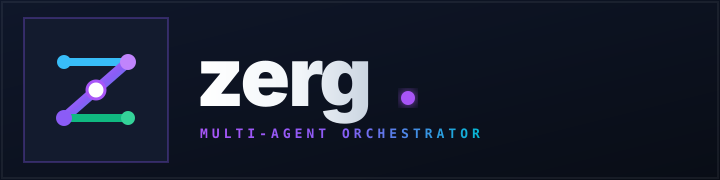

<p align="center">
  
</p>

<p align="center">
  <b>Multi-agent coding orchestrator</b><br>
  A Go daemon supervises a team of agent harnesses working in isolated git worktrees, routes work between them, and serves a Vue 3 cockpit.
</p>

**Everything is configured in the UI.** No config files, no prompt files, no presets to copy. Point
it at a repo, pick your roles, start.

Status: **running.** Coordination, harnesses, preflight, board and cockpit are implemented and have
completed real tasks end to end. See [ARCHITECTURE.md](ARCHITECTURE.md).

## Why

Agents in separate git worktrees handing each other committed SHAs is the right shape for this
problem. Coordination and configuration are where it goes wrong, and both fail quietly.

Two incidents set the design. A day of running an earlier build produced four hangs that all
presented identically — an agent that looks alive and does nothing — every one of them detectable
before spawning. And a task was silently built in the wrong language, because config had been
snapshotted into the worktrees and a later edit reached no one.

So:

- **configure in the UI** — roles, harness, model, prompts are database rows, not files; prompts are
  composed fresh at every spawn, so an edit is live on restart
- **harnesses are adapters**, not a hardcoded switch — `claude` and `pi` first
- **model pickers from the harness's own catalog**, so you stop typing model ids that 400
- **preflight before spawn** — a stale CLI, a corrupt config, an unanswered trust dialog or a broken
  plugin tree becomes a visible blocked role with a stated remedy
- **agents emit structured events**, so the cockpit renders tool calls, tokens and cost instead of
  scraping a terminal
- **leases, not fire-and-forget** — unacked work returns to the queue; a stall is a state, not silence
- **your plan's headroom is on screen** — claude reports it on every turn, pi is asked for it; a
  bar per window, coloured only where it is nearly spent
- **a spent quota is a pause, not a crash** — a role that hits its subscription limit waits for the
  window and resumes itself, saying when ([§16](ARCHITECTURE.md#16-provider-limits))
- **one SQLite database**, one writer, real transactions
- **nothing reports success it did not observe** — see [§6.1](ARCHITECTURE.md#61-what-the-first-real-run-broke),
  which is the record of a task reaching Done over a branch that had never moved
- **it is a guest in your repository** — prompts are appended, never substituted, so your
  `CLAUDE.md` and `AGENTS.md` still apply; nothing is written into the tree but `.worktrees/`, and
  that ignore rule goes in `.git/info/exclude` rather than your `.gitignore`
  ([§4.4.1](ARCHITECTURE.md#441-what-zerg-injects-and-what-it-leaves-alone))

Provider setup is out of scope: log into `pi` and `claude` yourself. zerg detects credential state
and tells you what to fix — it never runs a login flow or touches an auth file.

## Approving, and where work lands

A role can be gated. A gated handoff is held before the next role sees it; a gated **last** role is
the approval that performs the merge, and it shows `git diff base...sha` — everything the task would
land, across every role and every lap, not just the final commit.

Per project you choose what that approval does: fast-forward the base branch, open a pull request
with `gh`, or leave the work on its branch. It is a project setting rather than a role setting
because only the last role integrates, and which role that is changes when you change the team.

Finished cards can be put away one at a time; the switch to show them again is off by default.

## Defaults

A library of eight role templates ships — planner, coder, reviewer, cleaner, architect, hardener,
security, docs. A new project selects `coder` (sonnet) → `reviewer` (opus) and runs. They are
ordinary rows: rename them, replace them, add four more. Nothing is special-cased.

## Layout

```
cmd/zerg/          daemon (zerg up) and agent client (zerg next|done|send|ask)
internal/
  overmind/        orchestrator core: start, stop, supervise, keep work moving
  cerebrate/       per-role agent supervisor
  adapter/         harness contract + claude, pi implementations
  agent/           unix socket serving the four agent verbs
  nydus/           message transport: work plane + control plane
  board/           cards and lanes
  chat/            ask the repository a question, outside the pipeline
  store/           sqlite (~/.zerg/zerg.db), migrations, role library
  event/           typed event bus, logging and usage recording
  preflight/       readiness checks run before anything spawns
  api/             http, serves the embedded cockpit
  hatchery/        workspace and worktree management
  tailnet/         tailscale status and certificates, via its CLI
web/               Vue 3 + Vite + shadcn-vue cockpit
```

## Stack

Go 1.27 · stdlib `net/http` · modernc.org/sqlite (cgo-free, so `CGO_ENABLED=0` and a static binary) · coder/websocket
Vue 3.5 · Vite 8 · shadcn-vue 2.8 (reka-ui) · Tailwind 4 · TypeScript 6 (pinned) · pnpm

`modernc.org/sqlite` and `coder/websocket` are the only non-stdlib Go dependencies. Pinned versions and their gotchas:
[ARCHITECTURE.md §14](ARCHITECTURE.md#14-stack).

## Setting up on a new machine

Four steps. The first three are things zerg checks and reports on rather than does for you — it
never runs a login flow or writes to an auth file.

### 1. Toolchain

| | Version | Why |
|---|---|---|
| **Go** | 1.27+ (`go.mod`) | builds the daemon; `CGO_ENABLED=0` works, the SQLite driver is pure Go |
| **Node** | 24.19.0 (`.nvmrc`) | builds the cockpit. Vite 8 needs `^22.18.0 \|\| >=24.12.0` |
| **pnpm** | 11 | `pnpm-lock.yaml` is the lockfile; `npm` will not reproduce it |
| **git** | any recent | worktrees are the isolation mechanism |

```sh
go version && node -v && pnpm -v && git --version
```

`build.sh` checks Node itself and refuses with the version it wanted, because a build that silently
runs on the wrong one fails much further downstream.

Optional: **`gh`**, only if a project integrates by opening a pull request. Merge and branch modes
never call it.

That is the whole list. No tmux, no babashka, no zsh — agents are child processes of the daemon
([§7.4](ARCHITECTURE.md#74-no-tmux)), so there is no session manager to install or attach to.

### 2. Log a harness in

At least one, and zerg will not do it for you:

```sh
claude          # then /login, and answer the trust prompt in any repo you will use
pi              # then /login for the provider whose models you plan to select
```

zerg reads credential state and reports it; it never runs a login flow or touches an auth file.
Readiness will tell you exactly which of these is missing per role — see step 4.

### 3. Build and run

```sh
./build.sh          # cockpit → web/dist → embedded in the binary → ./zerg
./zerg up           # 127.0.0.1:7717
```

Or by hand, which is what `build.sh` does:

```sh
pnpm --dir web install --frozen-lockfile && pnpm --dir web build
rm -rf internal/api/dist && cp -R web/dist internal/api/dist   # go:embed cannot reach outside its package
go build -o zerg ./cmd/zerg
```

State lives in `~/.zerg/zerg.db` (override with `--db`), which is created on first run along with
the eight built-in role templates. The directory and the database are `0700`/`0600` — they hold every
prompt, transcript and cost this machine has produced.

```
zerg up [--addr host:port] [--no-tls] [--db path] [--verbose]
```

`--addr` and `--no-tls` override the stored settings for one run. `--no-tls` is the way back in if a
TLS setting turns out not to be satisfiable: without it, saving one can lock you out of the settings
view that sets it.

### 4. Point it at a repository

In the cockpit: **Projects → Add a project** (an absolute path, checked to exist and be a
directory), then **Team** to choose roles, then **Readiness**. On the first Start, a directory that
is not a repository yet gets `git init` and one commit, because a worktree needs history to branch
from — that is the only commit zerg authors rather than an agent.

Readiness is the step worth not skipping, though you cannot really skip it: **Start refuses while
any enabled role is blocked**, and the refusal carries the report, so pressing it anyway lands you
on this screen. A team that cannot work must never reach a running board. It runs every check for
every enabled role and states a remedy for each failure:

| Check | What it catches |
|---|---|
| `binary_present` | the harness is not on PATH |
| `binary_version` | the CLI does not answer `--version` |
| `config_parses` | the CLI's own config is corrupt — two agents racing a read-modify-write once left one holding three concatenated copies of itself |
| `credentials` (pi) | no credential for the selected provider → *run pi and use /login for that provider* |
| `workspace_trusted` (claude) | the trust prompt was never answered for that directory |
| `model_available` | the model id is not in the harness's catalog |
| `extensions_loadable` (pi) | every extension failed to load, usually a Node version mismatch |

## Reaching it from a phone

The cockpit binds to `127.0.0.1:7717` and is responsive: below 768px the nav becomes a drawer, board
lanes stack, dialogs go full screen, and the top bar names the project beside the agent count.

### Check Tailscale first

```sh
tailscale status     # logged in, and what this machine is called
tailscale ip -4      # the address to bind to
```

zerg asks the same daemon the same questions (`tailscale status --json`), and reports the answer in
**Settings → Network** — so you can skip this and read it there. On a fresh machine the command is
faster, and four things can be wrong:

| Symptom | Meaning | Fix |
|---|---|---|
| `tailscale: command not found` | not installed | [tailscale.com/download](https://tailscale.com/download) |
| `Logged out` or a connection error | tailscaled is not running, or this machine is logged out | `tailscale up` |
| no MagicDNS name in `status` | MagicDNS is off | enable **MagicDNS** under DNS in the admin console |
| `tailscale cert <name>` fails | HTTPS certificates are off for the tailnet | enable **HTTPS Certificates** under DNS in the admin console |

Only the last one is specific to TLS; the first three are needed to reach the cockpit at all.
Everything here degrades rather than fails — a machine without Tailscale is the normal case, and
zerg says "not available" rather than erroring.

### Bind and secure it

In **Settings → Network**, set the address to the tailnet IP and TLS to **Tailscale certificate**.
For one run instead:

```sh
./zerg up --addr $(tailscale ip -4):7717
```

With TLS set to `tailscale`, zerg asks the local tailscaled for a real Let's Encrypt certificate for
this machine's MagicDNS name, so a phone gets no warning. `tailscale cert` is idempotent and renews
in place, so this happens on every start and reuses a valid certificate. Certificates land in
`~/.zerg/state/certs/`.

The alternative is TLS **files**, pointing at a certificate and key you already have.

`localhost` keeps working alongside it: a second listener serves plain HTTP on loopback on the same
port — one daemon, two doors — so local work does not need the MagicDNS name, and a network setting
that breaks the main listener cannot lock you out of the view that sets it. Turn it off with
**Local access** if you would rather it did not.

Address and TLS changes apply on restart, and the settings view says so; retention and cleanup apply
immediately. The daemon prints the URL at startup, and both of them once there are two:

```
Cockpit: https://your-machine.tailXXXX.ts.net:7717
Locally: http://127.0.0.1:7717
note: reachable at 100.x.y.z:7717 beyond this machine, with no authentication.
      Treat anything that can route to it as trusted.
```

> **The cockpit has no authentication.** Anything that can route to that port can start agents, read
> every transcript, and see which repositories are being worked on. On a tailnet that is your own
> devices, which is the point; `--addr 0.0.0.0` also hands it to whatever else shares the local
> network. The daemon says which of the two you have chosen at startup.

### Installing it as an app

The cockpit ships a web manifest with `display: standalone`, so **Add to Home Screen** on iOS or
**Install** on Android gives it its own window with no browser chrome. Dialogs account for the
notch, spanning the safe-area insets rather than the raw viewport.

## Running it unattended

`zerg up` runs in the foreground and its agents are its children, so closing the terminal stops
everything. There is no `--detach` yet; use a launchd or systemd unit, or `nohup`.

A restart is a first-class path, not a recovery hack: every open lease is reclaimed immediately
rather than left to lapse, and an approval interrupted mid-integration is settled against the
repository — merged means the decision is recorded and the card closed, not merged means it returns
to you as pending. Swarms do not resume by themselves, which is deliberate while spawning an LLM
process costs money.

## Tests

```sh
go test ./internal/...            # coordination, routing, store, adapters
pnpm --dir web test               # the cockpit's logic: arg round-trips, stale-response guards, combobox keys
```

Neither spends a token. The coordination layer is testable without one, and is tested that way. Tests that
assert an effect check the system that was supposed to change — git, the database — rather than
reading back a field the code set. [§6.1](ARCHITECTURE.md#61-what-the-first-real-run-broke) is what
happens when they don't.
