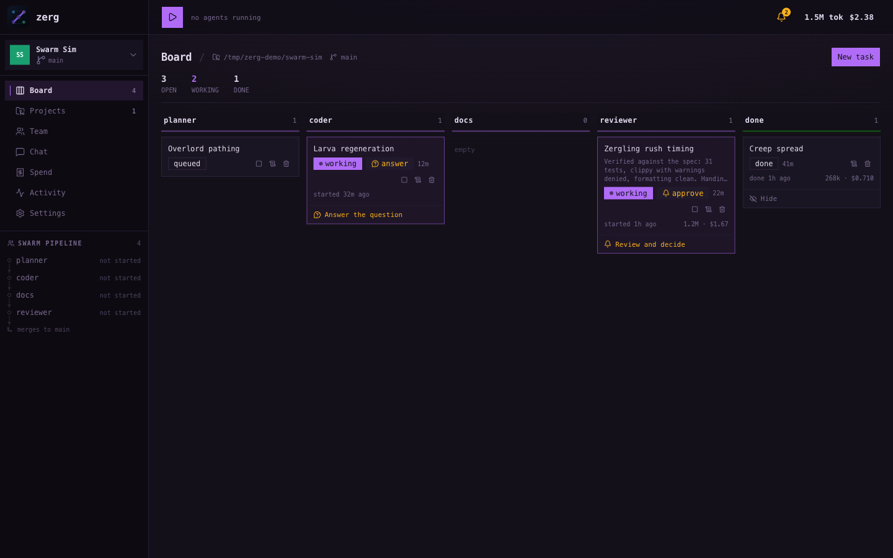
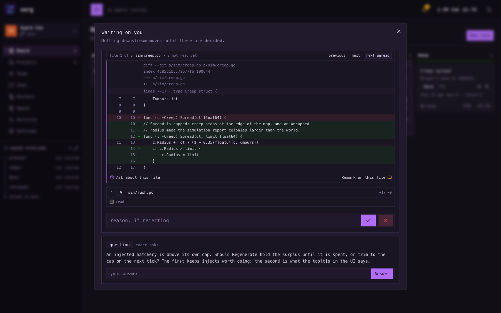
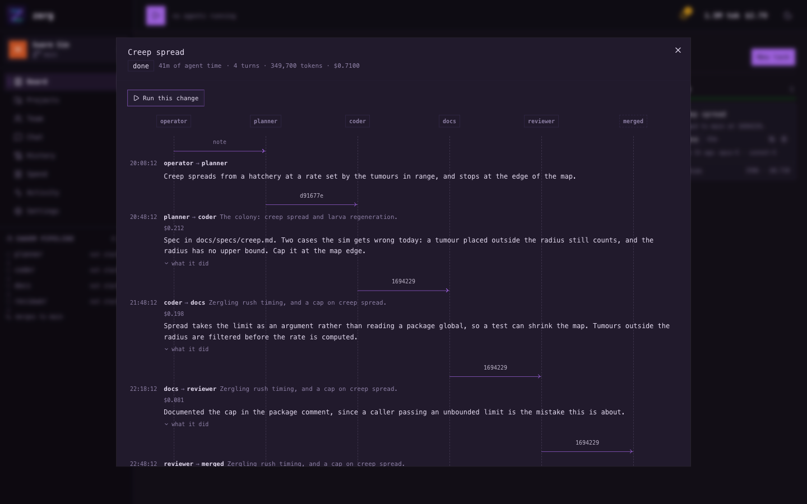
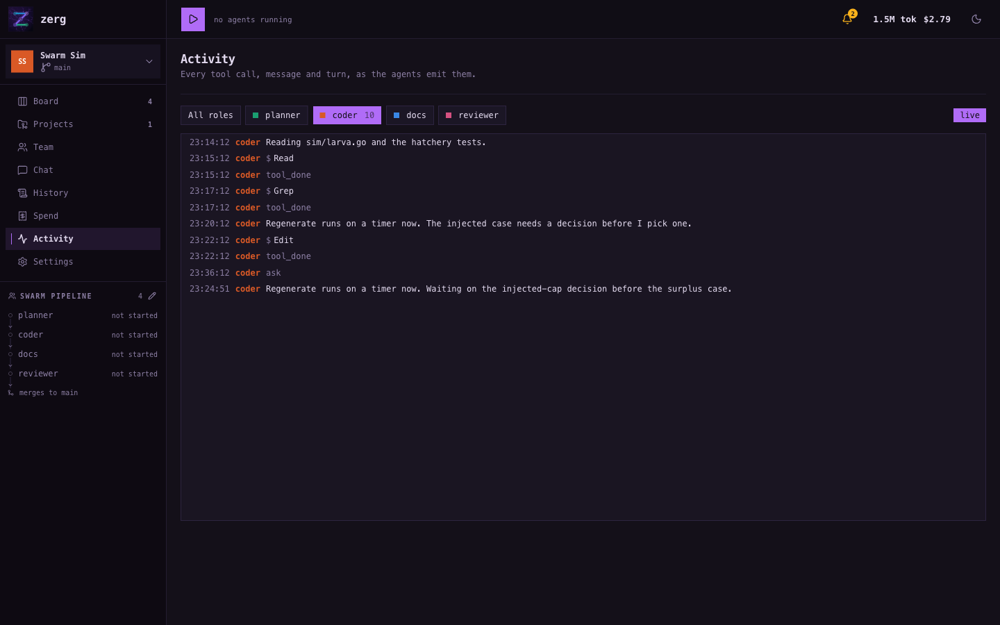
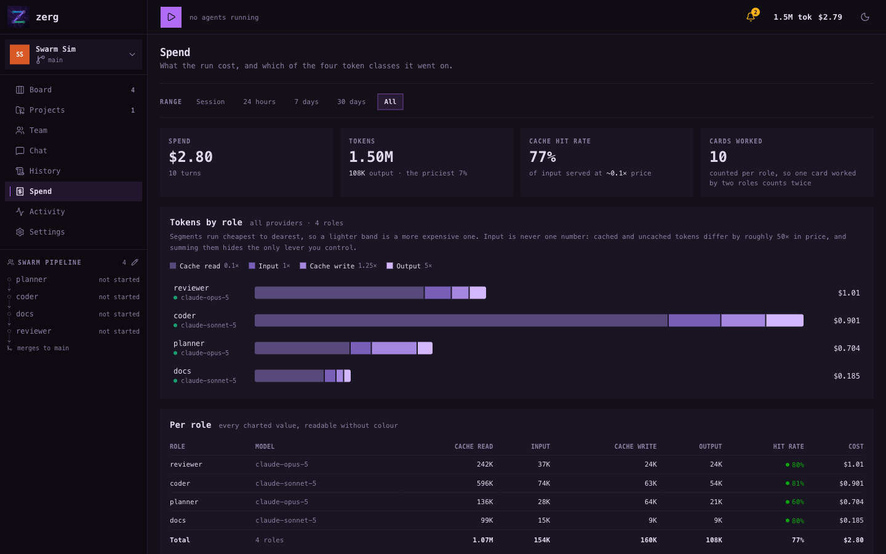
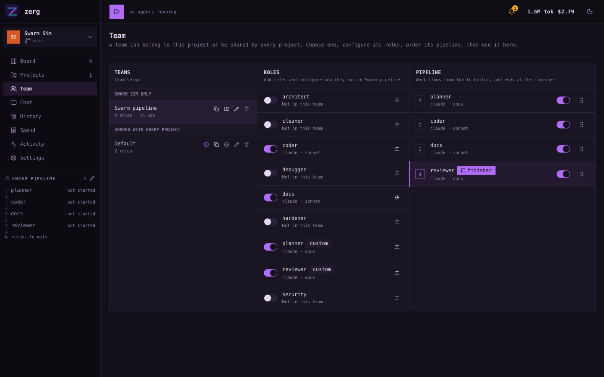
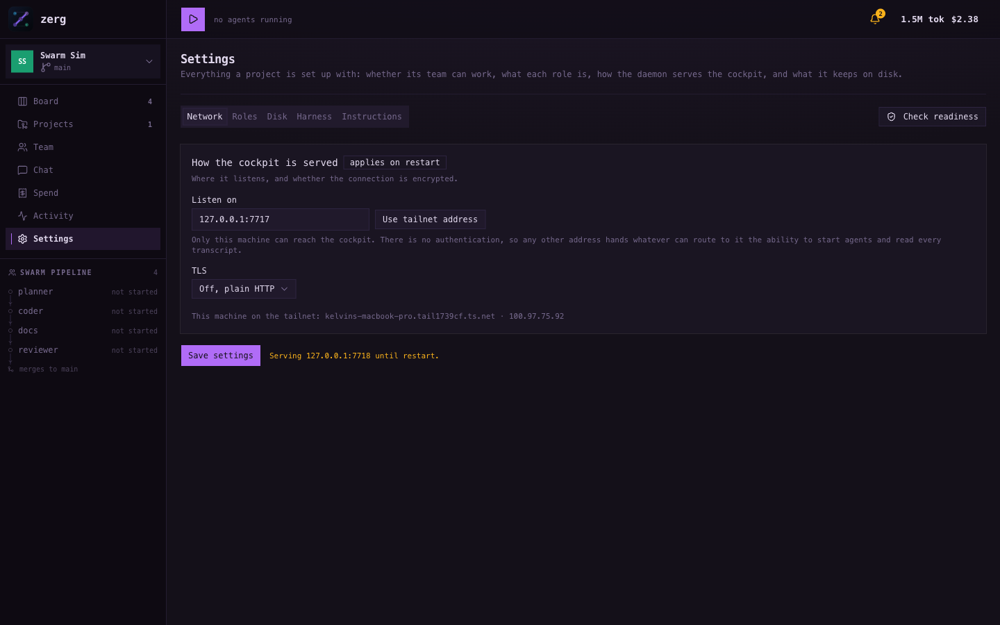
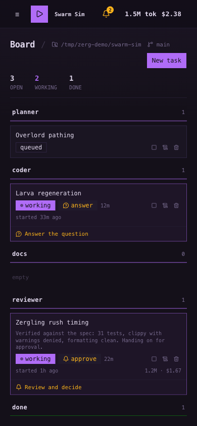
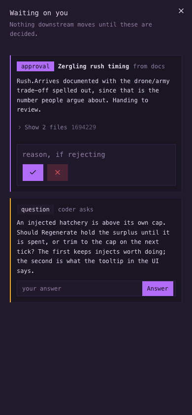

<p align="center">
  
</p>

<p align="center">
  <b>Multi-agent coding orchestrator</b><br>
  zerg supervises coding agents in isolated git worktrees, routes work between them, and serves a Vue 3 cockpit from one local process.
</p>

**Everything is configured in the UI.** Define reusable teams, assign one to each project, and
change only the settings that project needs. There are no config files or prompt files to copy.

zerg works end to end, but it is not stable yet. Install it from source and expect forward-only
database and API changes.

```sh
git clone https://github.com/kconfesor/zerg.git && cd zerg
./build.sh && ./zerg up          # http://127.0.0.1:7717
```

Before you run it:

- **Agents run with your permissions.** zerg starts `claude`, `pi`, and the commands they choose as
  child processes. This is the same trust decision as running those tools yourself, several at a
  time and unattended.
- **The API has no authentication.** Bind it to loopback or a Tailscale tailnet. Never expose it to
  the public internet. Read [SECURITY.md](SECURITY.md) before changing the bind address.
- **macOS, Linux, and WSL only.** Native Windows is not supported.
- **No release binaries yet.** The cockpit is compiled into the binary, but you must build that
  binary yourself for now.

| | |
|---|---|
| [What it looks like](#what-it-looks-like) | screenshots before you install it |
| [How it works](#how-it-works) | roles, teams, worktrees, gates, and integration |
| [Set it up](#setting-up-on-a-new-machine) | toolchain, harness login, and first project |
| [Reach it from a phone](#reaching-it-from-a-phone) | Tailscale, TLS, and installing it as an app |
| [ARCHITECTURE.md](docs/ARCHITECTURE.md) | design decisions and the failures behind them |
| [CONTRIBUTING.md](CONTRIBUTING.md) | development loops and checks |
| [SECURITY.md](SECURITY.md) | threat model and private vulnerability reporting |

## Why this exists

I got tired of looking at terminal screens. With several agents running, the state of the work ends
up scattered across sessions: which one is waiting, which one is stuck, what it committed, and what
the run has cost. The answer goes stale as soon as you switch panes.

The phone is what made me build zerg. Approvals and questions still need an answer after you leave
the desk, but terminal sessions are poor phone interfaces and disappear when the screen locks. zerg
keeps the state in SQLite and presents it as a board: what each role is doing, where each task is,
what it has spent, and what needs a decision.

## What it looks like

These screenshots use a demo project named `swarm-sim`. Its pipeline has a gated planner, coder,
docs role, and gated reviewer.

**Board.** Each role has a lane, and each card shows its state, age, and cost.



**Attention.** Approvals and questions appear together. A final approval shows everything the task
would land, not only the last commit.



**Card history.** Every handoff records the role, note, and commit. Rejections point back to the role
that must respond.



**Activity.** Structured events show tool calls, messages, turns, tokens, and cost without scraping
a terminal.



**Spend.** Usage is grouped by role and provider, with cached and uncached input shown separately.
Subscription values are labelled as estimates.



**Team and settings.** The team editor controls pipeline order and role settings for every project on
that team. For one project only, the rail beside the board edits the same pipeline: add a role, turn
one off, or reorder it without leaving the board. The role library holds reusable defaults for
harnesses, models, prompts, and gates.





**Phone.** Navigation becomes a drawer, lanes stack, and dialogs fill the screen.

<p>
  
  
</p>

> The screenshots use a seeded database and a toy repository. The numbers are examples, not a
> performance or cost benchmark.

## How it works

A **role** is one agent process with its own harness, model, prompt, inbox, and git worktree. A
**team** is an ordered pipeline of roles. The built-in Default team runs a coder followed by a
reviewer, and the role library includes planner, coder, reviewer, debugger, cleaner, architect,
hardener, security, and docs templates.

A team either belongs to one project or is shared by all of them. A team is where prompts, models and
arguments are tuned for a particular repository, so one built for project X stays out of project Y:
it is not in Y's picker, and editing it cannot change what Y runs. Teams meant to be reused, like
Default, are shared, and a shared team can be cloned into a project when you want your own copy to
change.

Work enters at the first enabled role. Each role commits its changes and hands the commit SHA to the
next role, so downstream work starts from code rather than a description. The final role integrates
the result by fast-forwarding the base branch, opening a pull request with `gh`, or leaving the work
on its branch, according to the project setting.

Any role can require approval before its handoff moves. A gated final role shows
`git diff base...sha`, covering every role and every lap of the task, before integration.

The operational rules are simple:

- Roles, teams, models, prompts, and project overrides live in SQLite and are edited in the cockpit.
- Prompts are composed from current settings before every spawn.
- Preflight checks harness binaries, versions, credentials, trust state, models, and extensions
  before any role starts. A model missing from the harness catalog is a warning rather than a block,
  because a free-text model ID may still work.
- Agents emit structured events for the activity stream, usage, and cost.
- Leased work returns to the queue when a process disappears.
- A role that exhausts a provider quota pauses until the window resets instead of crashing.
- zerg appends its instructions to the harness. It does not replace project instructions such as
  `CLAUDE.md` or `AGENTS.md`.
- In an existing repository, the only directory zerg creates is `.worktrees/`, ignored through
  `.git/info/exclude` rather than the repository's `.gitignore`.

[ARCHITECTURE.md](docs/ARCHITECTURE.md) documents the full configuration model, process lifecycle,
message protocol, database, and the failures that shaped these decisions.

## Choosing a harness and reviewer

zerg currently supports `pi` and `claude` through the same adapter interface. Use whichever harness
has the models, subscription, and workflow you prefer. Model options come from the harness itself,
with free text available when a catalog lags a working model.

I get better reviews when the coder and reviewer use different model families, ideally from
different providers. They tend to make different mistakes. The Default team reflects that choice:
`coder` uses sonnet and `reviewer` uses opus, and you can change either globally, per team, or for one
project.

Gate the final reviewer and read both its note and the landing diff. A rejection sends the work back
to the role that produced it with your feedback attached.

## Technical shape

The daemon uses Go 1.27, `net/http`, SQLite, and WebSockets. The cockpit uses Vue 3.5, Vite 8,
shadcn-vue, Tailwind 4, and TypeScript 6. `modernc.org/sqlite` and `coder/websocket` are the only
non-standard Go dependencies.

```text
cmd/zerg/          daemon and agent-facing CLI
internal/api/      HTTP API and embedded cockpit
internal/store/    SQLite schema and queries
internal/nydus/    work routing, leases, and approvals
internal/overmind/ process lifecycle and supervision
internal/devui/    Vite lifecycle and proxy for local development
web/               Vue cockpit
```

See [ARCHITECTURE.md §14](docs/ARCHITECTURE.md#14-stack) for pinned versions and dependency notes.

## Setting up on a new machine

### 1. Install the toolchain

| Tool | Version | Purpose |
|---|---|---|
| **Go** | 1.27+ (`go.mod`) | builds the daemon |
| **Node** | 24.19.0 (`.nvmrc`) | builds or hot-reloads the cockpit |
| **pnpm** | 11 | installs the locked frontend dependencies |
| **git** | recent | provides worktree isolation |

Use macOS, Linux, or WSL. zerg uses Unix process groups and a Unix socket, so it does not compile
for native Windows.

### 2. Build zerg

```sh
git clone https://github.com/kconfesor/zerg.git
cd zerg
./build.sh
./zerg up
```

`build.sh` compiles the cockpit into `./zerg`. The resulting binary needs neither Node nor pnpm at
runtime.

If you are developing zerg itself, use the faster loop instead:

```sh
go build -o zerg ./cmd/zerg && ./zerg up
```

A source build starts Vite behind the daemon and hot-reloads the cockpit on the same URL. See
[CONTRIBUTING.md](CONTRIBUTING.md) for the full development loop and required checks.

### 3. Install and log into a harness

Install at least one supported harness: [Claude Code](https://code.claude.com/docs/en/install) or
[pi](https://github.com/badlogic/pi-mono/tree/main/packages/coding-agent). zerg reads the credential
state reported by the harness. It does not run login flows or store provider credentials.

```sh
claude          # then /login and answer the trust prompt for repositories you will use
pi              # then /login for the provider whose models you plan to select
```

At least one harness must be ready for the roles on your selected team.

### 4. Add a project

Open **Projects → Add a project** and enter an absolute directory path. Then open **Team**, select or
customize a team, and run **Readiness**.

Readiness checks every enabled role and blocks Start when a required harness binary, credential,
trust prompt, or extension is unavailable. A model absent from the harness catalog produces a
warning because free-text model IDs may still work. Each result includes a suggested fix.

If the target directory is not already a repository, the first Start runs `git init`, stages its
current contents, and creates the initial commit required for worktrees.

State lives in `~/.zerg/zerg.db` by default. The database contains tasks, prompts, transcripts, and
usage records and is not encrypted.

```text
zerg up [--addr host:port] [--no-tls] [--db path] [--no-dev-ui] [--verbose]
```

## Reaching it from a phone

zerg binds to `127.0.0.1:7717` by default. To reach it from a phone without exposing it publicly,
join the computer and phone to the same [Tailscale](https://tailscale.com) tailnet.

Check the computer's Tailscale state:

```sh
tailscale status
tailscale ip -4
```

Enable MagicDNS and HTTPS Certificates in the Tailscale admin console first. Then, in
**Settings → Network**, set the listener to the tailnet IP and choose **Tailscale certificate** for
TLS. For a one-time bind:

```sh
./zerg up --addr $(tailscale ip -4):7717
```

With Tailscale TLS enabled, zerg requests and renews a certificate for the machine's MagicDNS name.
It can also keep a second plain HTTP listener on loopback for local access. Address and TLS changes
apply after restart.

> **The cockpit has no authentication.** Anything that can route to its port can start agents, read
> transcripts, and change configuration. Use loopback or a tailnet you control. Do not bind it to a
> public interface or an untrusted LAN. See [SECURITY.md](SECURITY.md).

The cockpit includes a web manifest, so **Add to Home Screen** on iOS or **Install** on Android opens
it without browser chrome.

## Running unattended

`zerg up` runs in the foreground, and its agents are child processes. Closing the terminal stops the
daemon and its agents. There is no `--detach` command or packaged service unit yet; use launchd,
systemd, or `nohup` if you want it to survive a terminal session.

After a restart, zerg reclaims open leases and reconciles approvals interrupted during integration.
It does not restart swarms automatically because spawning agent processes can spend money.

## Roadmap and limitations

The [Roadmap milestone](https://github.com/kconfesor/zerg/milestone/1) tracks planned work. Current
items include more harness adapters, line-level diff review, and deployable artifacts.

Additional limitations:

- Cross-project historical analytics and terminal takeover are designed but not implemented.
- `main` is the only supported version, and migrations move forward in place.

## Contributing

Bugs, ideas, and pull requests are welcome. [CONTRIBUTING.md](CONTRIBUTING.md) contains the development
loops and checks. [AGENTS.md](AGENTS.md) contains the same project rules for coding harnesses.

Report security issues through [GitHub's private vulnerability reporting](https://github.com/kconfesor/zerg/security/advisories/new),
not a public issue.

## Licence

[Apache License 2.0](LICENSE). Copyright 2026 Kelvin Confesor.
